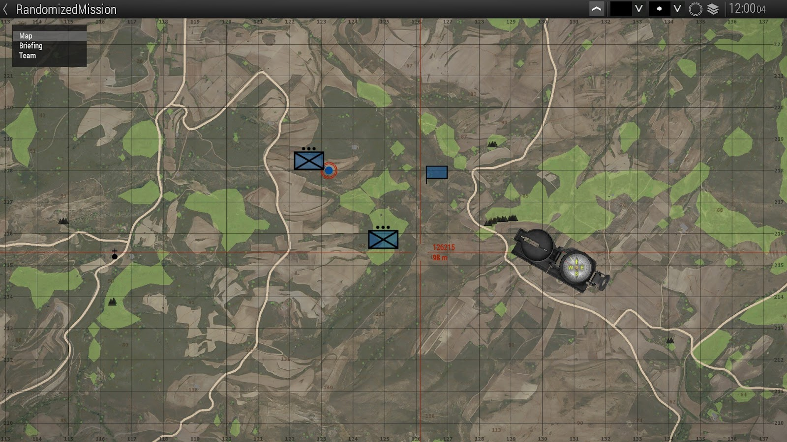

### not finished  <br> still needs images

# Guide by CheriWX, the guide itself is unfinished and is a Google Doc. <br> I didn't create the guide.


Hi my name is Cheri and I would like to share some scripting things I have learned throughout my 3-4 years playing Arma 3. This is not going to get into the complex scripting as I do not want to learn them BUT! This will help any new mission maker who does want to make a semi good story. So here we go. 

1: ORBAT MARKERS. 
This is going to get a little complex so bear with me. 
First what you would need to do is place a unit down and click “Scenario”, after that click “Save As” 
1:

2: 


Afterwards you can save it under any name you want. For this example I chose to name it “RandomizedMission”

After that exit the Arma 3 browser and head to Files then Documents and Arma 3 Other Profiles
 

Now for this I have other profiles but pick the one you are already using so for this example I will click “Creator”
After that go into the “Missions Folder” (ignore highlighted folder) 


Then find the mission you have. Again for this example I will load the one named “RandomizedMission” but pick the one you named yourself.


For this next part this is where it confuses most people. I was even stumped at this myself so pay attention!
Within the mission folder add a text document 

Depending on ur scripting Option I believe it is the same. But for me I use Notepad. But you will want to open the file and rename it to “description.ext” and hit for files “save all” At this stage you should have 2 documents delete the one that IS NOT the .ext file!


Now once that is all done you will need to add the Orbat script. So for this example I will use a preset that I got off of a youtube video with minor changes. I will also link the Official Bohemia ORBAT Scripting Guide at the end of this tutorial. But for now just copy this template Into the description.ext file it should look like this: 


## Template
```cpp
class CfgORBAT
{
class c1
{
 id = 1;
 idType = 2;
 type = "HQ";
 side = "West";
 commander = "MacKinnon";
 commanderRank = "Colonel";
 text = "ION HQ";
 textShort = "%1 %3";
 description = "Private Military Contractor ION's designated Commanding Officer";
 
 class test2
 {
  id = 1;
  idType = 2;
  type = "Infantry";
  side = "West";
  size = "Platoon";
  commander = "Simon";
  commanderRank = "Sergeant";
  text = "ION INC Rifleman Company";
  textShort = "%1 %3)";
  description = "Platoon led by Simon Mayfield. Composed of ION Private Military Contractors on the island of Altis";
 };
 
 class test3
 {
  id = 1;
  idType = 2;
  type = "Infantry";
  side = "West";
  size = "Platoon";
  commander = "Akheagos";
  commanderRank = "Major";
  text = "IONSF";
  textShort = "%1 %3)";
  description = "Unknown unit on the island of Altis";
 };
};
};
```
Once your done copying the script, relaunch Arma 3 and load that mission. Once there, go over to the Systems tab in the Eden Editor and in the Modules section look for orbat in the search bar. 

Since with the script there are 3 Defined CfgOrbat’s linked in the script place down 3 modules under “Strategic” 
Once there in one module type this 
```cpp
missionconfigfile >> "CfgORBAT" >> “c1"
```

Put this script in both the CfgPath and Ceiling within one module. It should look like this

 
Once done open up another module and copy that exact text, but for the Path add this

```cpp
missionconfigfile >> "CfgORBAT" >> "c1" >> “test2”
```

Do the same for the other Module but instead of “test2” do “test3”
 (NOTE! DEPENDING ON WHAT THE VARIABLE NAME IS IN THE SCRIPT WILL BE THE SAME WHEN ADDING THIS INTO THE PATH! If your script has it defined by “c2” then in the path it should also be “c2”) 


The end Result should look like this! 




You can also do other neat tricks such as adding Insignia to the Orbat marker or vehicles tied to the script as well! 
Lets just say you want to do the Insignia for a Vanilla NATO/AAF Orbat Marker. Well all you would need to do is just add a bit of extra code on the lead CfgOrbat Script. 

Underneath description add this code: 

```cpp
texture = "a3\ui_f_orange\data\displays\rscdisplayorangechoice\faction_nato_ca.paa";`
insignia = "a3\missions_f_epa\data\img\orbat\b_aegis_ca.paa";
```

So it should look like this in the description.ext file! 
```cpp
class CfgORBAT
{
class c1
{
 id = 1;
 idType = 2;
 type = "HQ";
 side = "West";
 commander = "MacKinnon";
 commanderRank = "Colonel";
 text = "ION HQ";
 textShort = "%1 %3";
 description = "Private Military Contractor ION's designated Commanding Officer";
 texture = "a3\ui_f_orange\data\displays\rscdisplayorangechoice\faction_nato_ca.paa";
 insignia = "a3\missions_f_epa\data\img\orbat\b_aegis_ca.paa";
```
In the mission it will look like this! 


Now for vehicles it's the same story! 
We will revert back to the original lead CfgOrbat Script but again after description just add this code: 
```cpp
assets[] =
 {
	{ "B_Heli_Transport_03_F", 5 }
  };
};
```
So it will look like this!

```cpp
class CfgORBAT
{
class c1
{
 id = 1;
 idType = 2;
 type = "HQ";
 side = "West";
 commander = "MacKinnon";
 commanderRank = "Colonel";
 text = "ION HQ";
 textShort = "%1 %3";
 description = "Private Military Contractor ION's designated Commanding Officer";
 assets[] =
  {
	{ "B_Heli_Transport_01_F", 5 },
  };
 };
```


So in the mission it should look like this! 


IT IS WISE TO NOT USE THIS ON THE LEAD CfgORBAT Marker and rather use this script on the other 2! This will cause errors!

As far as Orbat goes that is all I know so far. So here are the links for all of the Orbat Related Scripts! 

ORBAT Viewer – Arma 3 - Bohemia Interactive Community
CfgVehicles GUER – Arma 3 - Bohemia Interactive Community
The CfgVehicles has other Tabs such as WEST and EAST Factions as well (Blufor, Opfor) the link includes the Indfor Factions! 

 (NOTE!) 
If you're trying to add vehicles to the marker make sure to copy the vehicle name you wanna add. By checking the CfgVehicles tab. And the number after the init name for the vehicle is the amount of vehicles tied to that marker
```cpp
{ "B_Heli_Transport_01_F", 5 },
```
The vehicle in this list is a transport helicopter with 5 of them being tied to this marker. 

NOTE: I do not know how to add or remove markers at this time, So it is wise if your going to do missions that include this script make sure it only has 3 units preferably a Command unit, and 2 other rifleman units with vehicles or without. 


2: Variable Names (SetName, SetSpeaker, SetFace
For this example we won't need to leave the Eden editor at all. This is more simple than CfgOrbat. But for this example we will be using the same mission file as before. 

Put down a unit and in the variable name put anything you want, but for this example we will put “test”. 


Now for this next part we will need 3 scripts to change his face, speaker, and name which will be these 3 
```cpp
this setSpeaker "Male02ENG";  
this setName ["Example", "Example","Example"];
this setFace "WhiteHead_11";
Since our variable name is “test” we will have to change the “this” portion of the script and put “test instead” so it should look like this! 

test setSpeaker "Male02ENG";  
test setName ["Example", "Example","Example"];
test setFace "WhiteHead_11";
```
If any unit has a variable name make sure the “this” is set to whatever the variable name is! 
For now we will put this script into the Init variable of that unit and hit “Ok”


We will now launch the game and the script will override all of the defined things above, such as the face, name, and voice of that unit!


WITH SCRIPT!


WITHOUT SCRIPT!


The script is good for also making Main characters and what not! 
Heres some link of the other scripts as well as available faces and voices! 
https://community.bistudio.com/wiki?title=setFace
setSpeaker - Bohemia Interactive Community
Just know that with the “setSpeaker” there are Greek, Russian, Polish, French, and British voices as well! To enable them just add the first 3 letters of that language. Like for example! POL, RUS, GRE, FRE and B!
OR! 
```cpp
this setSpeaker "Male02ENGB"; 
this setSpeaker "Male02RUS"; 
this setSpeaker "Male02POL"; 
this setSpeaker "Male02GRE"; 
this setSpeaker "Male02FRE"; 
```
For the faces 

